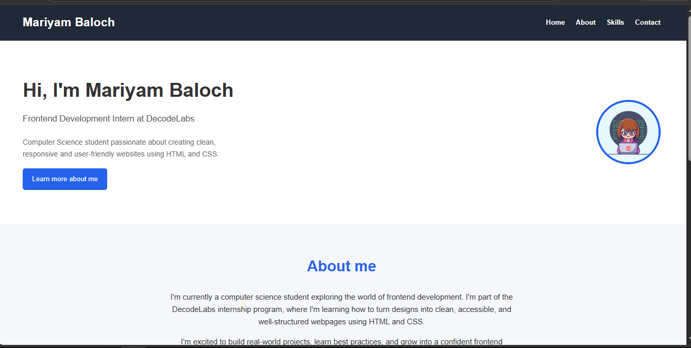

# Mariyam Portfolio - Project 1

A professional, modern, and fully responsive personal portfolio website built from scratch. This project showcases clean semantic HTML5 structure, modular layout components using modern CSS (Flexbox & Grid), and a responsive design that adapts beautifully to desktops, tablets, and mobile devices.



## About Me & Role

- **Name:** Mariyam Baloch
- **Role:** Frontend Development Intern at DecodeLabs
- **Objective:** Developing optimized, accessible, and clean user-friendly interfaces to transform visual designs into structural code.

## Key Project Features

- **Semantic HTML5:** Built using high-quality semantic tags for better accessibility (SEO & Screen Readers).
- **BEM CSS Architecture:** Implemented Block-Element-Modifier (BEM) naming conventions for clean, maintainable, and scalable CSS.
- **Responsive Layouts:** Uses media queries along with CSS Flexbox for navigation/hero sections and CSS Grid for the skills card matrix.
- **Interactive Visuals:** Smooth hover effects on navigation links, interactive Call-to-Action (CTA) buttons, and dynamic transform elevations on skill elements.
- **Smooth Scrolling:** Clean single-page navigation layout mapped via section IDs.

## Tech Stack & Tools Used

- **Structure:** HTML5 (Semantic Structure)
- **Styling:** CSS3 (Custom Properties, Flexbox, Grid Layouts, Media Queries)
- **Design Pattern:** Mobile-Responsive & Fluid Grid Adaptation
- **IDE:** VS Code

## Project Structure Overview

```text
Project 1/
├── Images/
│   ├── htmlogo.jpg
│   ├── csslogo.png
│   ├── VScodelogo.png
│   ├── Githublogo.png
│   ├── responsiveDesign.png
│   └── myprofile.jpg
├── images/
│   └── ScreenShot.PNG      <-- (Your portfolio preview screenshot)
├── index.html              <-- Main markup structure
└── style.css               <-- Styled layout rules
```
