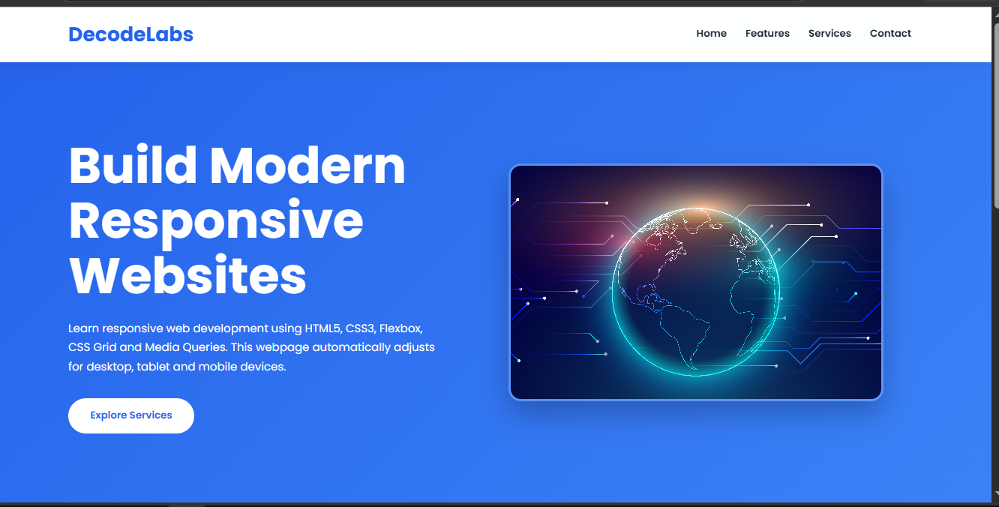

# Responsive Web Layout



## Project Description

This project is a modern and responsive website developed using HTML5 and CSS3. It demonstrates responsive web design principles using Flexbox, CSS Grid, and Media Queries. The website automatically adapts to different screen sizes, including desktop, tablet, and mobile devices.

## Features

- Responsive Navigation Bar
- Hero Section with Call-to-Action Button
- Features Section
- Services Section
- Responsive Footer
- CSS Flexbox Layout
- CSS Grid Layout
- Media Queries for Mobile and Tablet
- Modern UI with Hover Effects and Animations

## Technologies Used

- HTML5
- CSS3
- Flexbox
- CSS Grid
- Media Queries
- Google Fonts (Poppins)

## Project Structure

```
Project-2/
│── index.html
│── style.css
│── hero.jpg
│── README.md
```

## How to Run

1. Download or clone the project.
2. Open the project folder.
3. Double-click **index.html** or open it using **Live Server** in Visual Studio Code.

## Learning Objectives

- Build responsive web layouts
- Practice Flexbox and CSS Grid
- Use Media Queries for different screen sizes
- Create modern and user-friendly web interfaces

## Author

**Mariyam Baloch**

Frontend Development Internship Project
DecodeLabs
