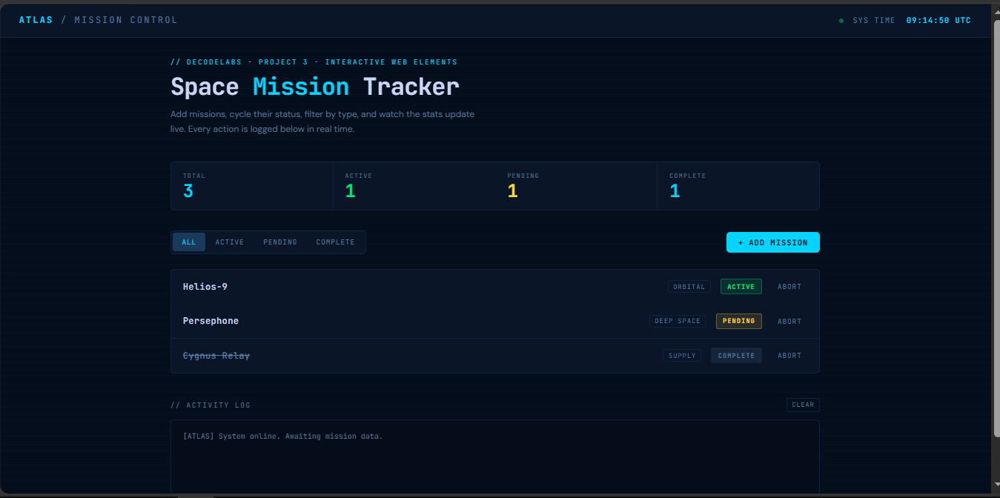

# ATLAS Mission Control - Space Mission Tracker (Project 3)

An interactive, high-fidelity real-time dashboard simulating a futuristic space mission control interface. This project focuses on complex DOM manipulation, robust state management (centralized application state array), event delegation patterns, custom CSS transitions, and advanced data filtering without relying on external libraries or frameworks.



## Internship Context

- **Developer:** Mariyam Baloch
- **Role:** Frontend Development Intern at DecodeLabs
- **Project Matrix:** Project 3 (Interactive Web Components & State Logic)

---

## Key Engineering Features

- **Centralized Application State:** Modeled on modern framework mentalities, the dashboard handles addition, completion cycling, and deletion through a single source of truth (`missions` state array) to guarantee UI and stat synchronicity.
- **Efficient Event Delegation:** Rather than mounting listeners on every individual row item, a single event listener is attached to the parent containment vector (`.js-mission-list`) to parse sub-component triggers (`.js-cycle-status`, `.js-abort`) dynamically via structural mapping IDs.
- **Live System Analytics:** Processes sub-sets of arrays using native JavaScript vector math (`.filter()`, `.length`) to generate atomic dashboard count updates in real-time.
- **Asynchronous Time Vector Operations:** Utilizes isolated timing threads (`setInterval`) to sync structural UI modules with zero-padded atomic universal coordinate tracking (UTC).
- **Cyberpunk CRT Aesthetics:** Completely dependency-free visual styling highlighting subtle responsive grids, modern variable fonts (`JetBrains Mono`), custom state attribute matching selectors (`data-status`), and an automated scanline texture mask developed via repeating linear gradients.
- **Secure Input Traps (XSS Protection):** Sanitizes reactive dynamic elements prior to rendering vectors into internal markup configurations through structural RegEx encoding mechanisms.

---

## Technological Profile & Architecture

- **Structural Blueprint:** Semantic HTML5 Structure
- **Aesthetic Matrices:** Advanced CSS3 (Custom Variables, Flexbox Integration, Dynamic CSS Grid Tracks, Custom Timing Transitions)
- **Logic Core:** Functional Vanilla JavaScript (ES6+ Layout Patterns, Event Capturing and Bubbling Vectors)
- **Fonts Pattern:** JetBrains Mono (Data Readouts) & DM Sans (UI Labels)

---

## Project Directory View

```text
Project 3/
├── images/
│   └── ScreenShot.PNG      <-- High-resolution dashboard operational snapshot
├── index.html              <-- Main application layout & reactive script engine
└── (No external dependencies — compiled cleanly inside standard single file)
```
